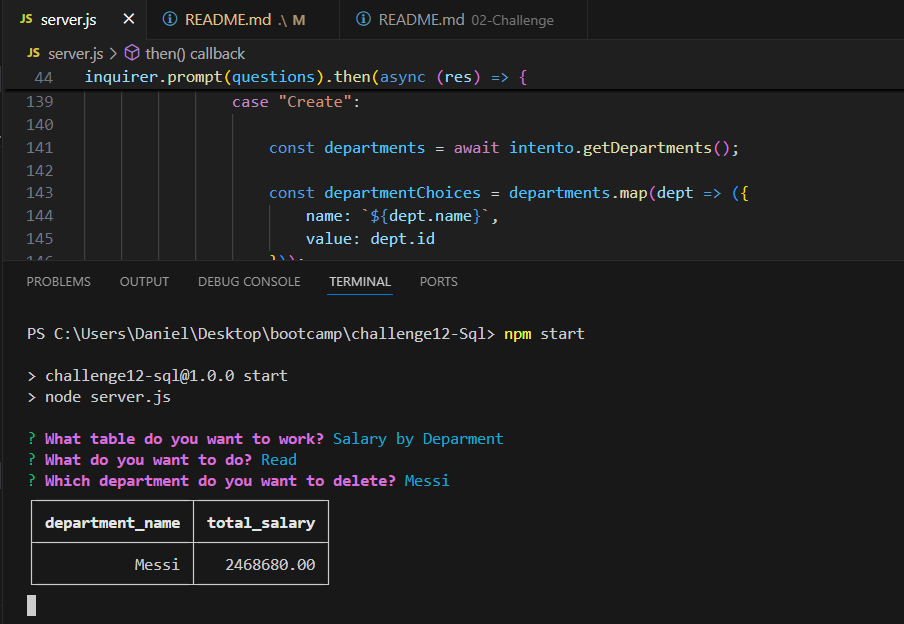

# challenge12-Sql

## Description
This project is designed to manage and store information about a company using SQL and JavaScript classes.

## Motivation
The main motivation behind this project is to apply my knowledge of SQL and JavaScript while enhancing my skills in object-oriented programming.

## Purpose
The goal of this project is to eliminate paper records by storing company information digitally, allowing for faster and more efficient searches.

## Problem Solved
By transitioning from paper records to a digital format, this project enables quicker access to information and better data management.

## Lessons Learned
Throughout this project, I improved my understanding of SQL and JavaScript, particularly in the context of class-based programming.

## Table of Contents
- [Installation](#installation)
- [Usage](#usage)
- [Credits](#credits)
- [License](#license)
- [Features](#features)
- [How to Contribute](#how-to-contribute)
- [Tests](#tests)

## Repository and Video
- **Video Demonstration:** [Watch the video](https://app.screencastify.com/v2/manage/videos/SYPGNxywJ4tg9nBBlsi7)
- **Code Repository:** [View the code on GitHub](https://github.com/danielsantana9824/challenge12-SqlEmployeeTracker)

## Installation
To set up this project on your local machine, follow these steps:

1. Clone the repository to your local machine.
   ```bash
   git clone https://github.com/danielsantana9824/challenge12-SqlEmployeeTracker.git
   ```
2. Navigate to the project directory.
   ```bash
   cd challenge12-SqlEmployeeTracker
   ```
3. Install the required dependencies:
   ```bash
   npm install
   ```
4. Ensure your PostgreSQL database is running using the following command:
   ```bash
   psql -U postgres
   ```
5. Execute the SQL schema and seed files:
   ```sql
   \i schema.sql;
   \i seeds.sql;
   ```

## Usage
Run the application using the following command in your terminal:
```bash
npm start
```

Answer the prompts to interact with the application and manage your company's information.

### Example Screenshot


## Credits
If you collaborated with others, list their names and provide links to their GitHub profiles here.

## License
This project is licensed under the MIT License. For more information on licenses, please refer to [Choose a License](https://choosealicense.com/).

## Features
- Automates the creation of README files based on user input.
- User-friendly prompts for entering project details.
- Generates a clean, professional README file with all necessary sections.

## How to Contribute
If you would like to contribute to this project, please fork the repository and submit pull requests. Ensure that you adhere to coding standards and provide meaningful descriptions for your changes.

Refer to the [Contributor Covenant](https://www.contributor-covenant.org/) for contribution guidelines.

## Tests
To run tests for this application, ensure that you have set up a testing environment. You can add instructions on how to run the tests here:
```bash
npm run security
```

